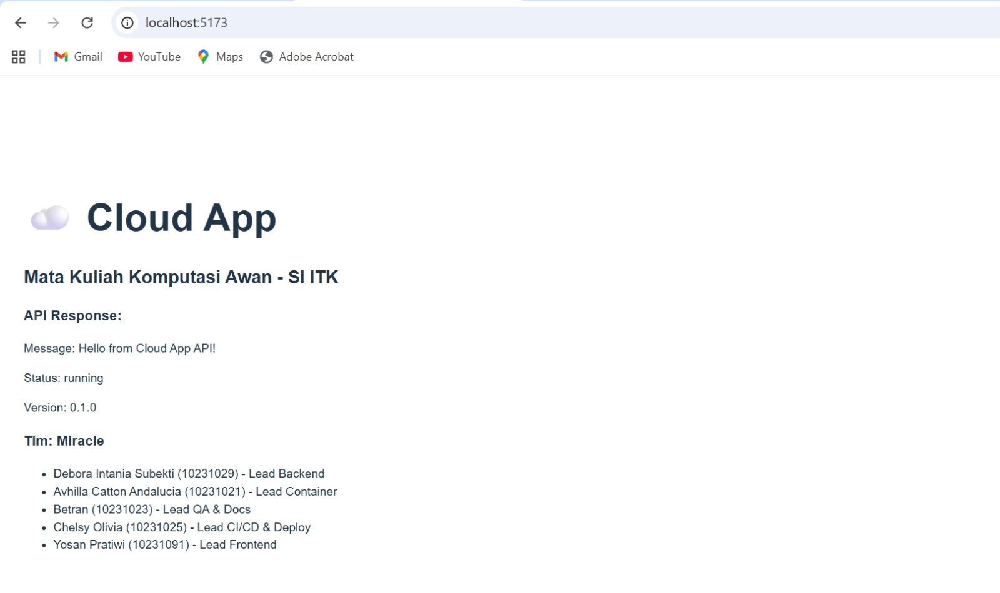
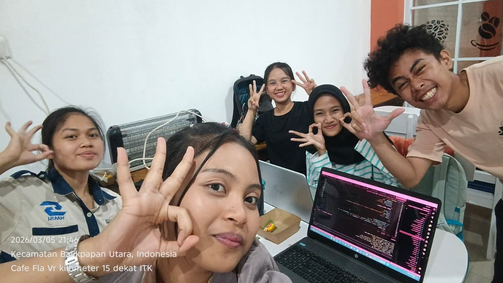
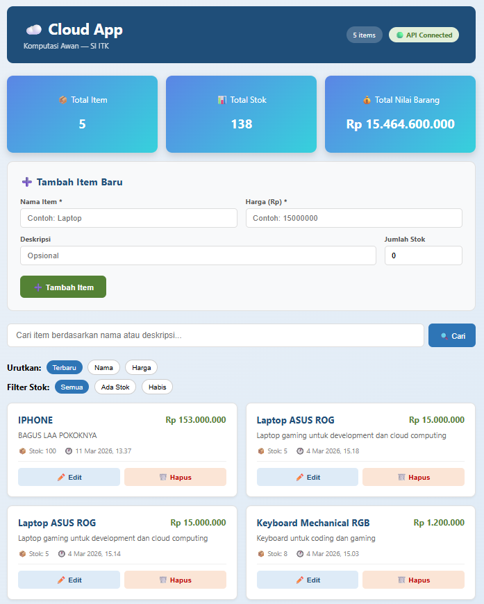

# 🩸 Tracelt<font color="gray"><sup><sup>by Miracle</sup><sup></font>
## Pengajuan Pendonor Darah

<div align="justify">
TraceIt merupakan aplikasi berbasis web yang dirancang untuk membantu civitas akademika Institut Teknologi Kalimantan dalam mengajukan permohonan data pendonor darah sukarela. Melalui platform ini, pengguna dapat mengunggah data pribadi, berupa nama lengkap, jenis kelamin, berat badan, tinggi badan, golongan darah, usia, tanggal lahir, tanggal terakhir donor, riwayat donor (total donor), alamat dan riwayat kesehatan. Sistem akan menampilkan daftar laporan pendonor sukarela yang dapat difilter berdasarkan nama, jenis kelamin, umur dan golongan darah untuk mempermudah proses verifikasi kesiapan pendonor dalam menjadi pendonor darah.

Aplikasi ini ditujukan bagi 2 pengguna. Pertama, adalah civitas akademika Institut Teknologi Kalimantan yang berperan sebagai pendonor sukarela. Kedua, adalah admin yang berperan dalam memantau dan memverifikasi data pendonor yang telah diajukan. 

Sistem TraceIt ini berperan dalam mengatasi permasalahan adanya kekurangan informasi terkait penyedia sukarelawan donor darah yang dapat diakses penerima di lingkungan civitas akademika Institut Teknologi Kalimantan. TraceIt hadir sebagai solusi terpusat berbasis cloud yang memungkinkan pengelolaan data secara sistematis, aman, dan dapat diakses kapan saja serta dari berbagai perangkat. Dengan demikian, proses pendataan pendonor sukarelawan menjadi lebih cepat, transparan, dan efisien.
</div>

## 👥 Team 

| NAMA | NIM | TUGAS |
| :--- | :--- | :--- |
| Debora Intania Subekti | 10231029 | Lead Backend |
| Avhilla Catton Andalucia | 10231021 | Lead Container |
| Chelsy Olivia | 10231025 | Lead CI/CD & Deploy |
| Yosan Pratiwi | 10231091 | Lead Frontend |
| Betran | 10231023 | Lead QA & Docs | 

## 🛠️ Tech Stack

| Teknologi | Fungsi |
|-----------|--------|
| *FastAPI* | Backend REST API |
| *React* | Frontend SPA |
| *PostgreSQL* | Database |
| *Docker* | Containerization |
| *GitHub Actions* | CI/CD |
| *Railway/Render* | Cloud Deployment |

## 🏛️ Architecture

```
[React Frontend] <--HTTP--> [FastAPI Backend] <--SQL--> [PostgreSQL]
       |                            |
  Vite + JSX               REST API Endpoints
  (Port 5173)               (Port 8000)
```

> *(Diagram ini akan berkembang setiap minggu)*


---
## Getting Started Backend
### 🔎 Cek Versi Python (Opsional)

```bash
python --version
pip --version
```

### 📂 Masuk ke Folder Backend

```bash
cd backend
```

### 📦 Install Dependencies

```bash
pip install -r requirements.txt
```

### ▶️ Jalankan Server

```bash
uvicorn main:app --reload --port 8000
```

### 🌐 Akses di Browser

```bash
http://localhost:8000
```

### 📑 Swagger Documentation

```bash
http://localhost:8000/docs
```

## Getting Started Frontend
Buka terminal kemudian jalankan langkah-langkah di bawah ini:

### 📂 Masuk ke folder projek
```
npm create vite@latest frontend -- --template react
```

### 📑Kemudian masuk ke folder frontend
```
cd frontend
npm install
```
### ▶️Jalankan frontend
``` 
npm run dev
```


## 📅 Roadmap
| Minggu | Target | Status |
|------|-----|-------|
| 1 | Setup & Hello World | ✅ |
| 2 | REST API + Database | ✅ |
| 3 | React Frontend | ✅ |
| 4 | Full-Stack Integration | ⬜ |
| 5-7 | Docker & Compose	 | ⬜ |
| 8 | UTS Demo | ⬜ |
| 9-11 | CI/CD Pipeline | ⬜ |
| 12-14 | Microservices | ⬜ |
| 15-16 | Final & UAS	 | ⬜ |

## 📁 Struktur Proyek

```text
cc-kelompok-a-miracle/
├── backend/
│   ├── main.py
│   └── requirements.txt
├── docs/
│   ├── member-Avhilla.md
│   ├── member-BETRAN.md
│   ├── member-Chelsy.md
│   ├── member-Intan.md
│   └── member-YOSAN.md
├── frontend/
│   ├── public/
│   │   └── vite.svg
│   ├── src/
│   │   ├── assets/
│   │   │   └── react.svg
│   │   ├── App.css
│   │   ├── App.jsx
│   │   ├── index.css
│   │   └── main.jsx
│   ├── eslint.config.js
│   ├── index.html
│   ├── package.json
│   └── vite.config.js
├── .gitignore
├── package-lock.json
└── README.md
```


## 📂 Tabel ERD
```text
+-------+                   +---------------+
| ADMIN |                   | RIWAYAT_DONOR |
+-------+                   +---------------+
| id_admin (PK)    1     N  | id_riwayat (PK)
| nama_admin       +--------+ id_pendonor (FK)
| email            |        | id_admin (FK)
| password         |        | tanggal_donor
+-------+          |        | status_verifikasi
        |          |        | catatan
        +--(Verifikasi)     +-------+-------+
                   |                |
                   |                | N
                   |                |
                   |                | (Memiliki)
                   |                |
            +------+-------+        | 1
            |   PENDONOR   | <------+
            +--------------+
            | id_pendonor (PK)
            | nama_lengkap
            | gol_darah
            | ...
            +------+-------+
                   | 1
                   |
                   | (Memiliki)
                   |
         +---------+----------+              +-------------------+
      1  |                    |  1        N  | RIWAYAT_KESEHATAN |
+--------v-------+    +-------v-----------+  +-------------------+
|   GAMIFIKASI   |    | RIWAYAT_KESEHATAN |  | id_kesehatan (PK) |
+----------------+    +-------------------+  | id_pendonor (FK)  |
| id_gamifikasi  |    | id_kesehatan      |  | riwayat_penyakit  |
| id_pendonor(FK)|    | id_pendonor (FK)  |  | keterangan        |
| point          |    | riwayat_penyakit  |  +-------------------+
| voucher        |    | keterangan        |
+----------------+    +-------------------+

```
<br>

## Penjelasan ERD
<div align="justify">

1. Pendonor ↔ Riwayat_Donor (1 to Many)
Relasi: Satu Pendonor bisa memiliki banyak Riwayat_Donor.
Penjelasan: Setiap kali pendonor melakukan donor darah, data baru dicatat di tabel riwayat. Pendonornya satu, tapi catatan donornya bisa berulang kali.
Foreign Key: id_pendonor ada di dalam tabel Riwayat_Donor.
Pendonor ↔ Riwayat_Kesehatan (1 to Many)

2. Relasi: Satu Pendonor memiliki banyak catatan Riwayat_Kesehatan.
Penjelasan: Pendonor mungkin memiliki riwayat cek kesehatan atau penyakit yang berbeda-beda seiring waktu.
Foreign Key: id_pendonor ada di dalam tabel Riwayat_Kesehatan.
Pendonor ↔ Gamifikasi (1 to 1)

3. Relasi: Satu Pendonor memiliki satu data Gamifikasi.
Penjelasan: Ini adalah tabel profil poin/level. Satu akun pendonor hanya punya satu saldo poin/voucher.
Foreign Key: id_pendonor ada di dalam tabel Gamifikasi (bisa juga id_gamifikasi menjadi FK di Pendonor, tapi biasanya ID Pendonor dijadikan referensi unik di tabel Gamifikasi).
Admin ↔ Riwayat_Donor (1 to Many)

4. Relasi: Satu Admin dapat memverifikasi banyak Riwayat_Donor.
Penjelasan: Proses verifikasi (disetujui/tidak) dilakukan oleh Admin. Meskipun di oval gambar 2 atribut id_admin tidak digambar eksplisit di Riwayat_Donor, relasi "Memverifikasi" menyiratkan bahwa ID Admin perlu disimpan di Riwayat Donor untuk mencatat siapa yang memverifikasi.

</div>

## 📸 Dokumentasi ENDPOINT

| HTTP Method | Code | Response body | Penjelasan |
|-------------|------|---------------|------------|
| GET/health | 200  | `{"status": "healthy", "version": "0.2.0"}` | endpoint berjalan dengan benar | 
| POST/items | 201 | `{ "name": "Laptop", "description": "Laptop untuk cloud computing", "price": 15000000 "quantity": 10, "id": 14, "created_at": "2026-03-06T14:10:08.175853+08:00", "updated_at": null}` | Response ini menunjukkan bahwa data baru berhasil dibuat di server dengan status code 201 (Created). Server mengembalikan informasi produk seperti nama, deskripsi, harga, jumlah stok, id, serta waktu created_at, sementara updated_at masih null karena data belum pernah diperbarui. |
| GET/items | 200 | ` {"total":3,"items":[{"name":"Laptop","description":"Laptop untuk cloud computing","price":15000000,"quantity":10,"id":14,"created_at":"2026-03-06T14:10:08.175853+08:00","updated_at":null},{"name":"Laptop","description":"Laptop untuk cloud computing","price":15000000,"quantity":10,"id":13,"created_at":"2026-03-06T13:46:08.081030+08:00","updated_at":null},{"name":"Handphone","description":"Handhone untuk cloud computing","price":5000000,"quantity":10,"id":12,"created_at":"2026-03-05T20:22:16.156768+08:00","updated_at":null}]} ` | Response menunjukkan bahwa permintaan ke API berhasil mengambil data, yang ditandai dengan status code 200 (OK). Server mengembalikan data dalam format JSON yang berisi total data sebanyak 3 pada field total, serta daftar produk pada field items. Setiap item menampilkan informasi produk seperti name, description, price, quantity, id, serta waktu created_at dan updated_at. Data tersebut menunjukkan daftar produk yang tersimpan di sistem. |
| GET/item/stats | 200 | `{"total_items":3,"total_value":350000000,"most_expensive":{"name":"Laptop","price":15000000},"cheapest":{"name":"Handphone","price":5000000}}` | Response berisi ringkasan data produk. Field total_items menunjukkan jumlah seluruh produk yaitu 3 item. Field total_value menunjukkan total nilai seluruh produk sebesar 350.000.000. Bagian most_expensive menampilkan produk dengan harga paling mahal, yaitu Laptop dengan harga 15.000.000. Sedangkan cheapest menunjukkan produk dengan harga paling murah, yaitu Handphone dengan harga 5.000.000. JSON ini biasanya digunakan untuk menampilkan statistik atau summary data dari kumpulan produk. | 
| GET/items/{items_id} | 200 | `{"name":"Handphone","description":"Handhone untuk cloud computing","price":5000000,"quantity":10,"id":12,"created_at":"2026-03-05T20:22:16.156768+08:00","updated_at":null}` | Response menampilkan detail satu produk. Field name berisi nama produk yaitu Handphone, description menjelaskan bahwa produk digunakan untuk cloud computing, price menunjukkan harga produk sebesar 5.000.000, dan quantity menunjukkan jumlah stok yaitu 10 unit. Field id merupakan identitas unik produk di database, created_at menunjukkan waktu data dibuat, sedangkan updated_at bernilai null yang berarti data tersebut belum pernah diperbarui. | 
| PUT/items/{item_id} | 200 |`{"name":"PC","description":"Untuk Home Server","price":1000000,"quantity":23,"id":12,"created_at":"2026-03-05T20:22:16.156768+08:00","updated_at":"2026-03-07T09:45:54.375108+08:00"}` | Response JSON tersebut menampilkan **data produk yang telah diperbarui**. Produk memiliki **name** PC dengan **description** “Untuk Home Server”, **price** sebesar **1.000.000**, dan **quantity** sebanyak **23 unit**. Field **id** menunjukkan identitas unik produk di database. **created_at** menunjukkan waktu saat data pertama kali dibuat, sedangkan **updated_at** berisi waktu **terakhir data diperbarui**, yaitu **7 Maret 2026**, yang menandakan bahwa data produk tersebut sudah pernah diubah setelah dibuat. | 
| DELETE/items{items_id} | 204 | - | Respons API menunjukkan proses penghapusan data item berdasarkan ID menggunakan metode HTTP DELETE pada endpoint /items/{item_id}. Pada permintaan ini, nilai item_id yang digunakan adalah 12, sehingga sistem akan menghapus data item dengan ID tersebut dari database. Permintaan dikirim ke URL http://localhost:8000/items/12. Setelah proses dijalankan, server mengembalikan status code 204 (No Content) yang menandakan bahwa operasi penghapusan berhasil dilakukan. Status ini juga menunjukkan bahwa server tidak mengirimkan isi data pada response body karena data yang diminta telah berhasil dihapus dari sistem. | 


<br><br>
## setup.sh
<div align="justify">
setup.sh adalah file shell script yang digunakan untuk menjalankan serangkaian perintah secara otomatis pada sistem berbasis Linux atau Unix. File ini biasanya digunakan untuk menyiapkan (setup) lingkungan proyek, seperti menginstal dependensi, membuat virtual environment, atau menjalankan konfigurasi awal aplikasi. Dengan menjalankan setup.sh, pengguna tidak perlu menjalankan perintah satu per satu karena semua langkah instalasi sudah dituliskan dalam satu skrip yang dapat dieksekusi sekaligus.
</div>
<br>

**Cara Menjalankan Setup.sh di Windows**
1. Di Terminal Pilih Git Bash
2. Kmudian Ketikan kode ini lalu tekan enter:
```
./setup.sh
```
<br><br>

## Authentication

#### 1. GET /health
* Expected: 200, status healthy

#### 2. POST /auth/register
Respones
```
{
  "email": "intan@student.itk.ac.id",
  "name": "Aidil Saputra",
  "password": "Password123!"
}
```
* Expected: 201, data user kembali

#### 3. POST /auth/login
Response
```
{
  "email": "betran39@student.itk.ac.id",
  "password": "Password123!"
}
```
* Expected: 200 dapat akses_token

#### 4. GET /auth/me
* Input no parameter
* Expected: 401, "detail": "Not authenticated"
* Menandakan proteksi auth berjalan benar

#### 5. POST /items
```
{u 9
  "name": "Laptop",
  "description": "Laptop untuk cloud computing",
  "price": 15000000,
  "quantity": 10
}
```
* Expected 201 Detail item diperlihatkan

#### 6. GET /items 
```
{
  "total": 0,
  "items": [
    {
      "name": "Laptop",
      "description": "Laptop untuk cloud computing",
      "price": 15000000,
      "quantity": 10,
      "id": 0,
      "created_at": "2026-03-22T15:48:48.608Z",
      "updated_at": "2026-03-22T15:48:48.608Z"
    }
  ]
}
```
* Expected 200, detail item dikembalikan

#### 7. GET /items/1
* Header: Authorization: Bearer TOKEN_DARI_LOGIN
* Expected: 200 atau 404 jika id tidak ada

#### 8. PUT /items/1
* Header: Authorization: Bearer TOKEN_DARI_LOGIN
* Body:
```
{
"price": 15500000,
"quantity": 8
}
```
* Expected: 200, updated_at terisi

#### 9. DELETE /items/1
* Header: Authorization: Bearer TOKEN_DARI_LOGIN
* Expected: 204 tanpa body

#### 10. GET /items/stats/all
* Header: Authorization: Bearer TOKEN_DARI_LOGIN
* Expected: 200, field total_items, total_quantity, total_value, average_price

#### 11. GET /team
* Expected: 200, info anggota tim

## Curl Windows
* Register
curl.exe -X POST "http://127.0.0.1:8000/auth/register" -H "Content-Type: application/json" -d "{"email":"betran@student.itk.ac.id","name":"Betran","password":"Password123!"}"

* Login
curl.exe -X POST "http://127.0.0.1:8000/auth/login" -H "Content-Type: application/json" -d "{"email":"betran@student.itk.ac.id","password":"Password123!"}"

* Get me
curl.exe -X GET "http://127.0.0.1:8000/auth/me" -H "Authorization: Bearer TOKEN_DARI_LOGIN"

* Create item
curl.exe -X POST "http://127.0.0.1:8000/items" -H "Authorization: Bearer TOKEN_DARI_LOGIN" -H "Content-Type: application/json" -d "{"name":"Laptop","description":"Laptop untuk cloud computing","price":15000000,"quantity":10}"

## Note Bug

#### Swagger Authorize OAuth2 masih error 422
* Gejala: popup Authorize mengembalikan Unprocessable Content
* Penyebab: endpoint login menerima JSON email dan password, sedangkan popup OAuth2 Swagger mengirim format form username/password
* Referensi implementasi: main.py, auth.py

#### Dokumentasi stats endpoint masih tidak sinkron
* Di beberapa dokumen lama masih tertulis /items/stats atau bentuk response lama
* Endpoint aktual: GET /items/stats/all
* Referensi endpoint aktual: main.py
* Dokumen yang perlu disesuaikan: README.md, api-test-results.md
#### Penulisan beberapa route di README masih typo
* Contoh: DELETE/items{items_id} perlu jadi DELETE /items/{item_id}
* Lokasi: README.md

## Dokumentasi Week 1



## Dokumentasi Week 2


## Dokumentasi week 3
