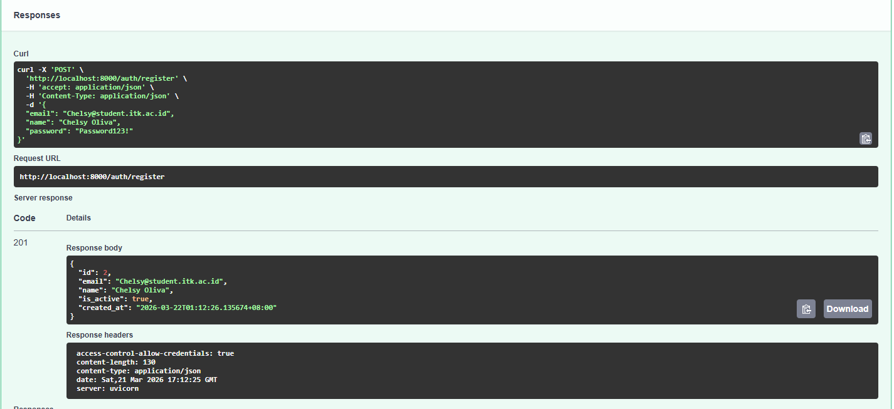
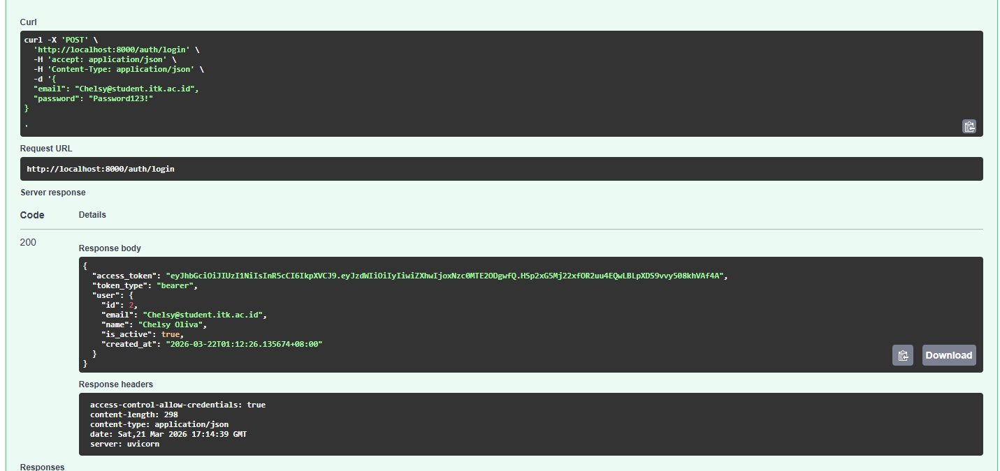
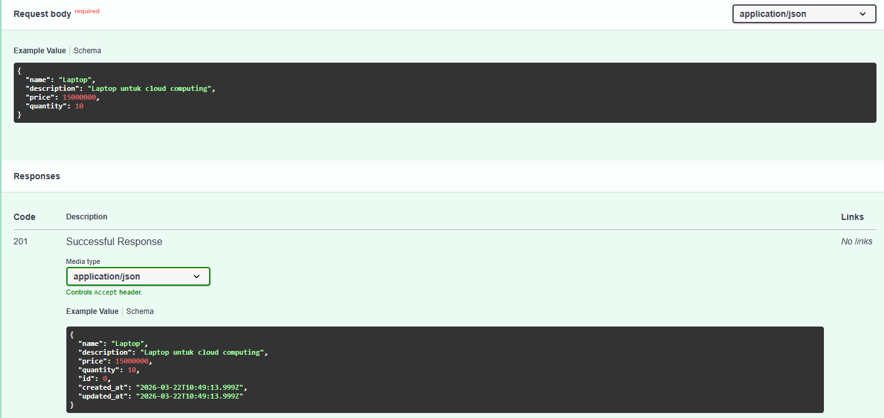
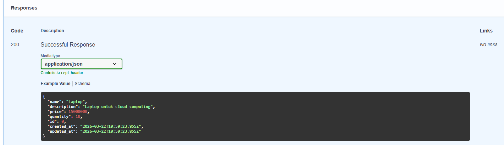
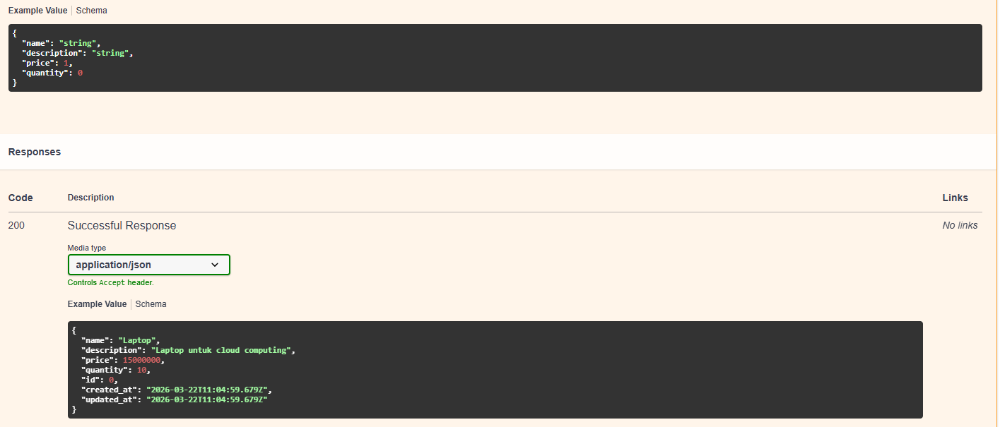
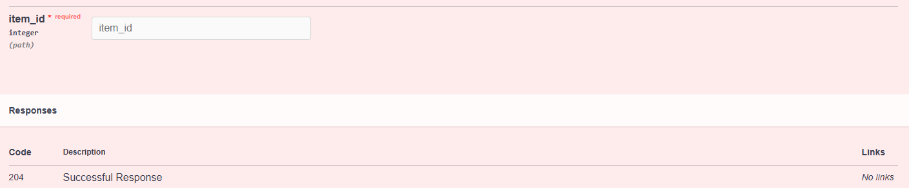

## DOKUMENTASI SEMUA ENDPOINT

# Method
### POST /auth/register
#### Deskripsi : Pada bagian ini untuk register akun baru


#### Request body
```
{
  "email": "intan@student.itk.ac.id",
  "name": "Aidil Saputra",
  "password": "Password123!"
}
```

#### Responses
Successful Response 201
```
{
  "id": 0,
  "email": "string",
  "name": "string",
  "is_active": true,
  "created_at": "2026-03-22T10:40:57.937Z"
}
```
#### Auth Required? : NO


### POST /auth/login
#### Deskripsi : Pada bagian ini untuk login ke akun yang sudah dibuat


#### Request body
```
{
  "email": "user@student.itk.ac.id",
  "password": "password123"
}
```
#### Responses
Successful Response 200
```
{
  "access_token": "string",
  "token_type": "bearer",
  "user": {
    "id": 0,
    "email": "string",
    "name": "string",
    "is_active": true,
    "created_at": "2026-03-22T10:47:28.924Z"
  }
}
```
#### Auth Required? : NO


### POST /items (create item)
#### Deskripsi : Pada bagian ini untuk menambahkan item baru


#### Request body
```
{
  "name": "Laptop",
  "description": "Laptop untuk cloud computing",
  "price": 15000000,
  "quantity": 10
}
```

#### Responses
Successful Response 201
```
{
  "name": "Laptop",
  "description": "Laptop untuk cloud computing",
  "price": 15000000,
  "quantity": 10,
  "id": 0,
  "created_at": "2026-03-22T10:49:13.999Z",
  "updated_at": "2026-03-22T10:49:13.999Z"
}
```
#### Auth Required? : YES


### GET /items/{item_id}
#### Deskripsi : Pada bagian ini untuk mengambil list items


#### Responses
Successful Response 200
```
{
  "name": "Laptop",
  "description": "Laptop untuk cloud computing",
  "price": 15000000,
  "quantity": 10,
  "id": 0,
  "created_at": "2026-03-22T10:59:23.855Z",
  "updated_at": "2026-03-22T10:59:23.855Z"
}
```
#### Auth Required? : YES


### PUT /items/{item_id}
#### Deskripsi : Pada bagian ini untuk update list item


#### Request body
```
{
  "name": "Laptop",
  "description": "Laptop untuk cloud computing",
  "price": 1,
  "quantity": 0
}
```
#### Responses
Successful Response 200
```
{
  "name": "Laptop",
  "description": "Laptop untuk cloud computing",
  "price": 15000000,
  "quantity": 10,
  "id": 0,
  "created_at": "2026-03-22T11:04:59.679Z",
  "updated_at": "2026-03-22T11:04:59.679Z"
}
```
#### Auth Required? : YES


### DELETE /items/{item_id}
#### Deskripsi : Pada bagian ini untuk menghapus list item


#### Responses
Successful Response 204

#### Auth Required? : YES


# Contoh Crul Command
#### crul : 
```
curl -X 'GET' \
  'http://localhost:8000/items?skip=0&limit=20' \
  -H 'accept: application/json'
```