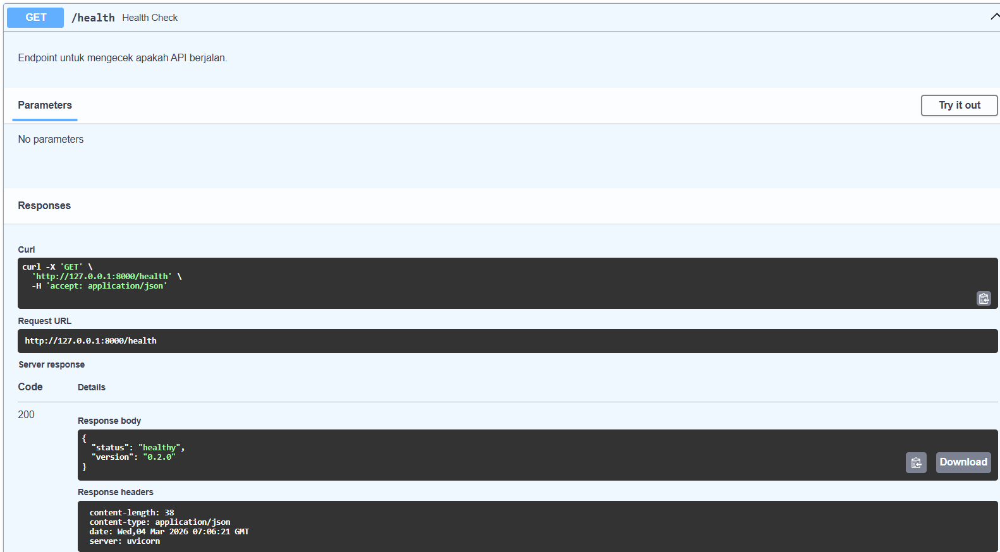
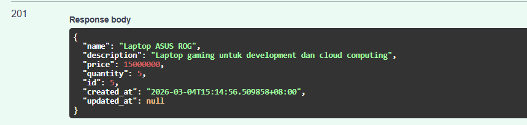
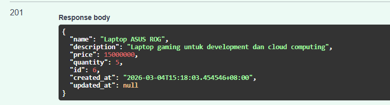
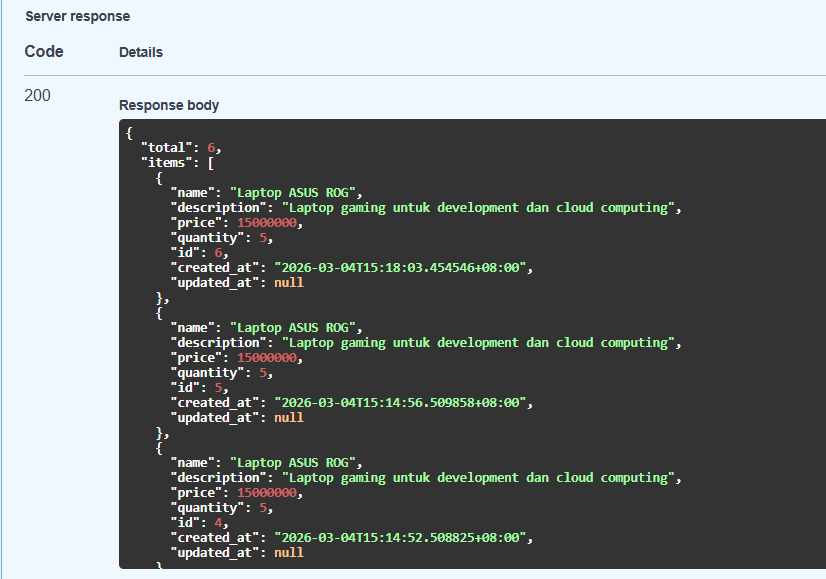
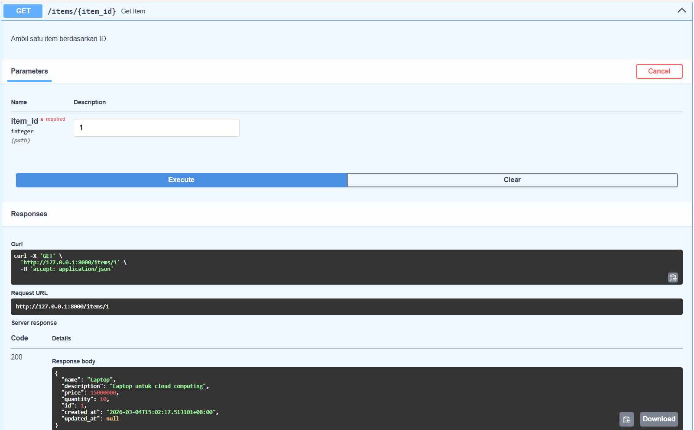
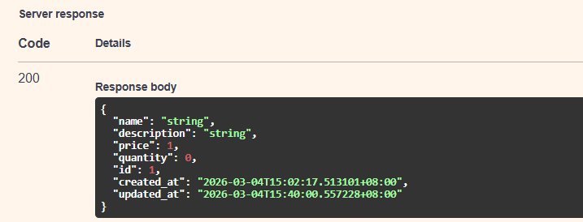
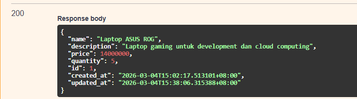
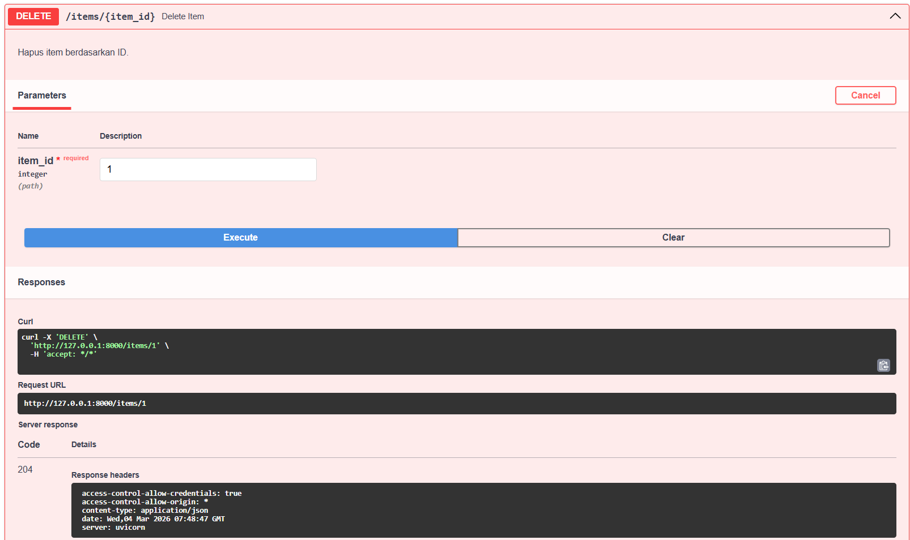
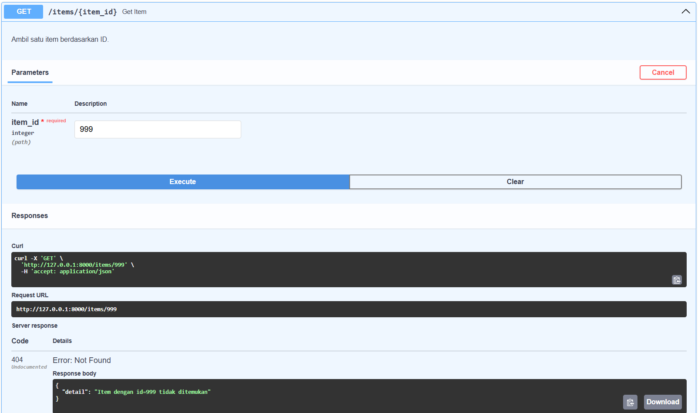
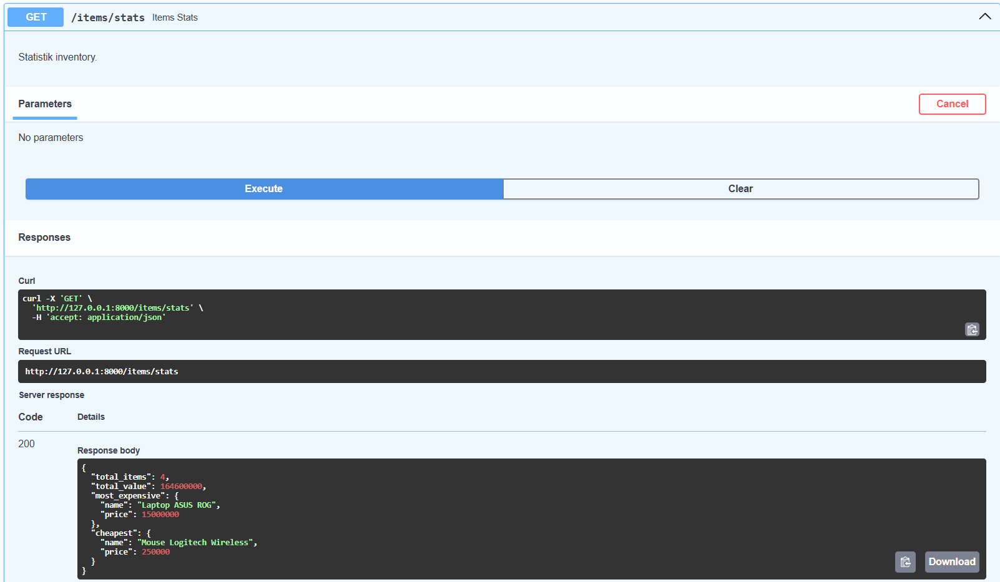

# API Testing Results

Dokumentasi ini berisi hasil pengujian seluruh endpoint backend menggunakan Swagger UI (http://localhost:8000/docs).

Seluruh endpoint diuji untuk memastikan:
- Response sesuai dengan spesifikasi
- Status code sesuai standar HTTP
- Validasi dan error handling berjalan dengan baik

---

## 1. GET /health

Endpoint ini digunakan untuk memastikan bahwa server berjalan dengan normal.

**Expected Result:**
- Status Code: 200 OK
- Response berupa JSON status server

### Hasil Pengujian
Server berhasil merespons dengan status 200 OK dan menampilkan informasi status layanan.

📸 Screenshot:

---

## 2. POST /items

Endpoint ini digunakan untuk menambahkan data item baru ke dalam database.

**Data yang Diuji:**
- name: Laptop ASUS ROG
- price: 15000000
- description: Laptop gaming untuk development dan cloud computing
- quantity: 5

**Expected Result:**
- Status Code: 201 Created
- Data berhasil ditambahkan
- Sistem menghasilkan ID otomatis

### Hasil Pengujian
Data berhasil ditambahkan ke database dan sistem mengembalikan response dengan ID item serta timestamp pembuatan data.

📸 Screenshot Request Body Sebelum Execute:

📸 Screenshot Response:

---

## 3. GET /items

Endpoint ini digunakan untuk menampilkan seluruh data item yang tersimpan di database.

**Expected Result:**
- Status Code: 200 OK
- Menampilkan total item
- Menampilkan daftar item

### Hasil Pengujian
Sistem berhasil menampilkan seluruh data item beserta total jumlah item yang tersedia di database.

📸 Screenshot:

---

## 4. GET /items/{item_id}

Endpoint ini digunakan untuk mengambil satu data item berdasarkan ID tertentu.

**Parameter yang diuji:**
- item_id: 1

**Expected Result:**
- Status Code: 200 OK
- Data item dengan ID tersebut ditampilkan

### Hasil Pengujian
Sistem berhasil menampilkan data item sesuai dengan ID yang diminta.

📸 Screenshot:

---

## 5. PUT /items/{item_id}

Endpoint ini digunakan untuk memperbarui data item berdasarkan ID.

**Data yang Diuji:**
- Update price menjadi 14000000

**Expected Result:**
- Status Code: 200 OK
- Data berhasil diperbarui
- Field updated_at berubah menjadi timestamp terbaru

### Hasil Pengujian
Sistem berhasil memperbarui data item dan mengembalikan response dengan data terbaru.

📸 Screenshot Request Body sebelum execute:

📸 Screenshot Response:

---

## 6. DELETE /items/{item_id}

Endpoint ini digunakan untuk menghapus data item berdasarkan ID.

**Expected Result:**
- Status Code: 204 No Content
- Data berhasil dihapus
- Tidak ada response body

### Hasil Pengujian
Sistem berhasil menghapus data item dan mengembalikan status 204 No Content tanpa response body.

📸 Screenshot:

---

## 7. GET /items/999 (Error Handling Test)

Endpoint ini diuji untuk memastikan sistem dapat menangani permintaan data yang tidak tersedia.

**Expected Result:**
- Status Code: 404 Not Found
- Pesan error sesuai dengan kondisi data tidak ditemukan

### Hasil Pengujian
Sistem berhasil menampilkan error 404 Not Found ketika item dengan ID yang diminta tidak tersedia.

📸 Screenshot:

---

## 8. GET /items/stats

Endpoint ini digunakan untuk menampilkan statistik keseluruhan data item.

Statistik yang ditampilkan:
- Total item
- Total value (price × quantity)
- Item dengan harga tertinggi
- Item dengan harga terendah

**Expected Result:**
- Status Code: 200 OK
- Perhitungan statistik sesuai dengan data di database

### Hasil Pengujian
Sistem berhasil menghitung total nilai seluruh item serta menentukan item termahal dan termurah secara akurat.

📸 Screenshot:

---

# Kesimpulan

Berdasarkan hasil pengujian yang telah dilakukan melalui Swagger UI, seluruh endpoint pada backend dapat berjalan dengan baik. Fitur CRUD (Create, Read, Update, Delete) sudah berfungsi sesuai dengan yang diharapkan. Proses validasi input dan error handling juga berjalan dengan benar, dibuktikan dengan munculnya status code yang sesuai seperti 200, 201, 204, dan 404. Endpoint tambahan untuk menampilkan statistik (/items/stats) juga berhasil menampilkan total item, total nilai keseluruhan, serta item dengan harga tertinggi dan terendah sesuai dengan data yang ada di database. Secara keseluruhan, sistem backend telah memenuhi tugas dan berjalan sesuai dengan kebutuhan yang ditentukan.