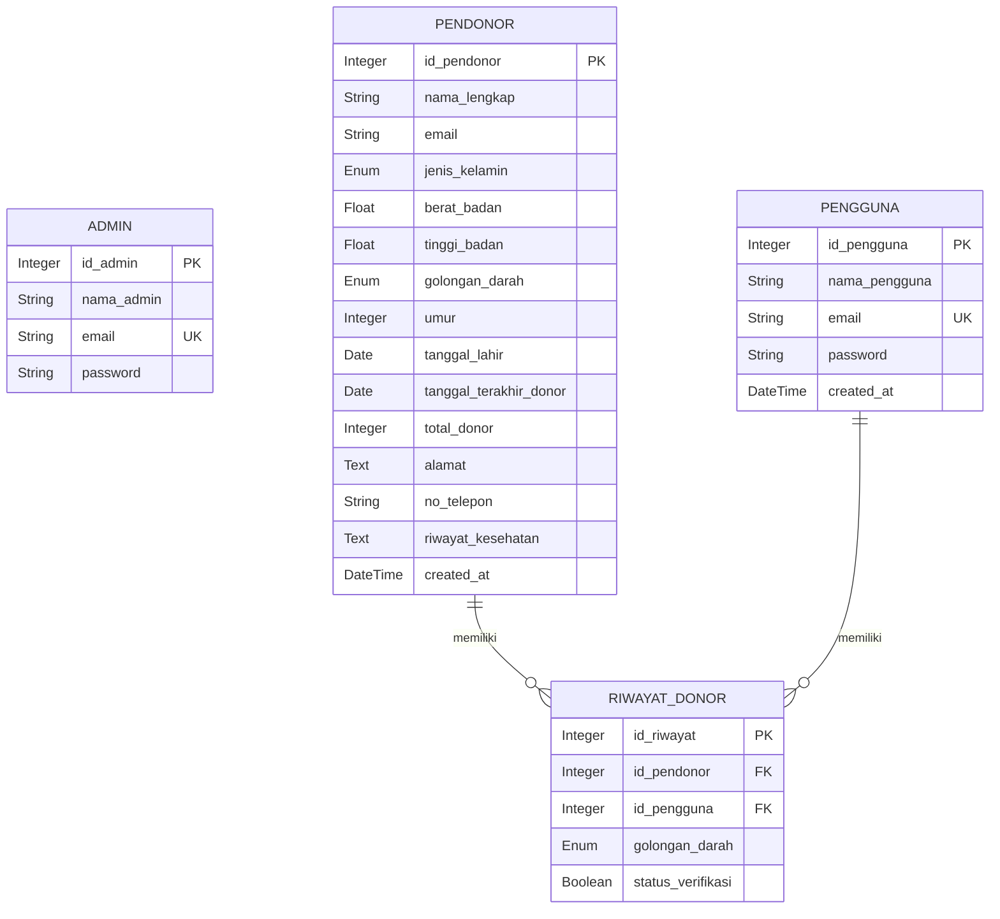

# Schema Database (Aktual Backend)

## Catatan Perubahan

- `pendonor.email` ditambahkan untuk menghubungkan input pendonor publik dengan akun pengguna ber-email sama.
- `pendonor.no_telepon` sudah bertipe `String`, bukan integer.
- Entitas non-implementasi (`riwayat_kesehatan`, `gamifikasi`) dihapus dari ERD dokumen karena tidak ada pada model backend aktif.