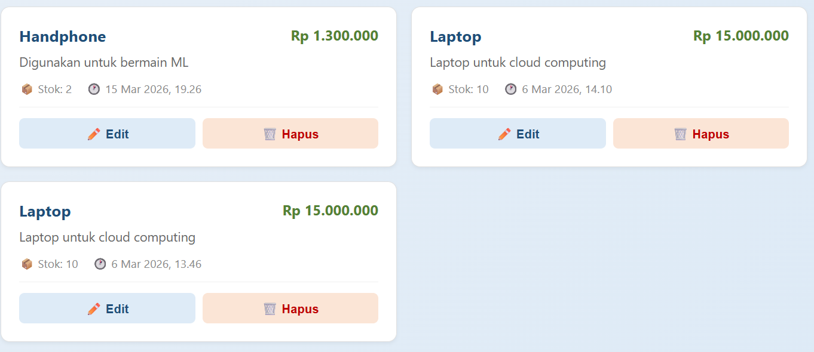
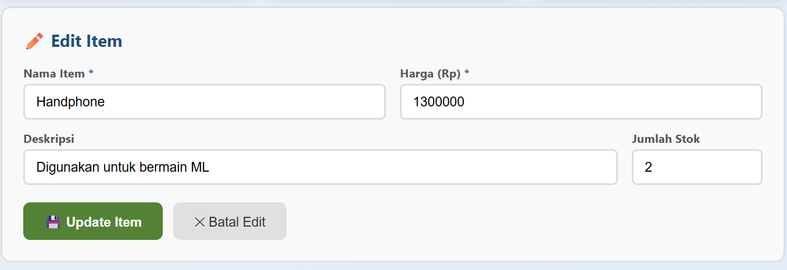
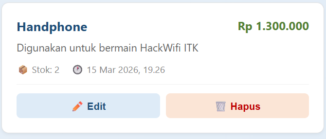
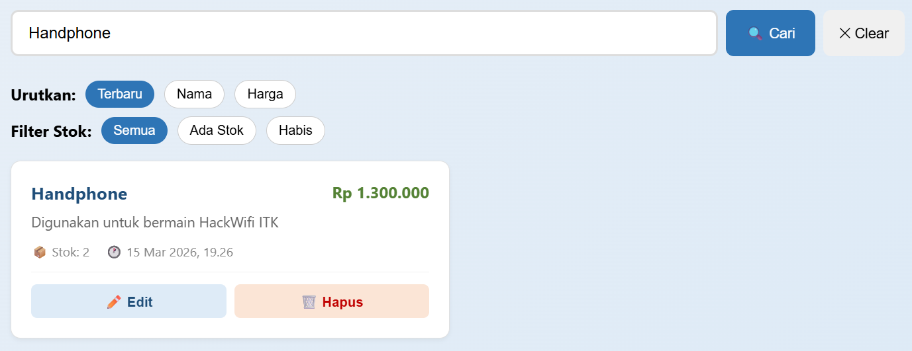
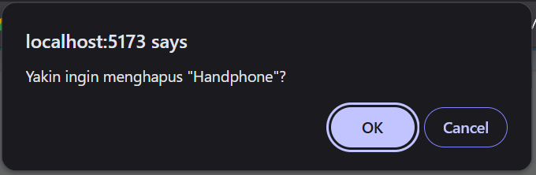
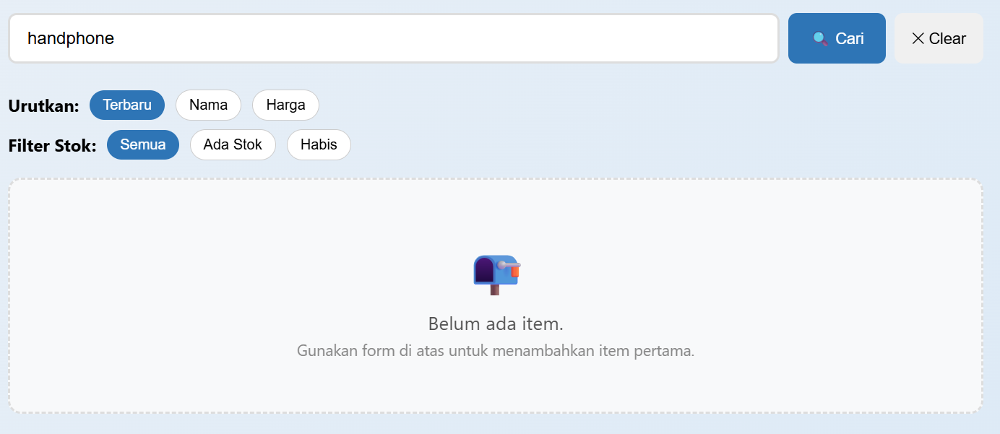
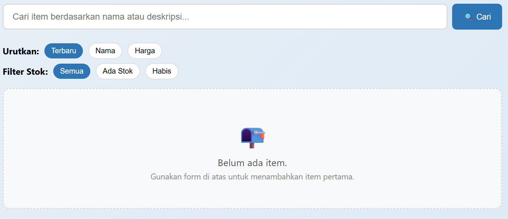

# Dokumentasi 10 Test Case

### 1️⃣ Cek Status API ✅

Status Menunjuakkan API Connected. Status yang menunjukkan aplikasi sedang tersambung dengan layanan backend, sehingga komunikasi data antara tampilan dan server berjalan dengan baik.
  

### 2️⃣ Cek List Barang ✅

Fitur manajemen daftar barang berjalan dengan baik: sistem berhasil menampilkan data item.
  

### 3️⃣ & 4️⃣ Tambah barang via Form (Include Tampilan) ✅

Menunjukkan Bahwa barang yang baru saja ditambahkan dapat tertampil di List barang
  

### 5️⃣ & 6️⃣ Fungsi Edit ✅

Gambar menunjukkan ketika menekan tombol Edit maka akan tertampil data lama dan Dapat di perbaharui

  

### 7️⃣ Fitur mencari Item ✅

Gambar menunjukkan saat mencari barang di kolom SearchBar dan mencari Handphone maka akan menampilkan handphone saja di List Barangnya
  

### 8️⃣ & 9️⃣ Menghapus Item ✅

Gambar menunjukkan ketika menekan tombol delete maka akan menampilkan dialog konfirmasi untuk menghapus. Dan Item tidak akan tertampil di list barang
  

### 🔟 Empty State ✅

Menunjukkan ketika semua barang yg ada di list dihapus maka akan menampilkan state berikut

